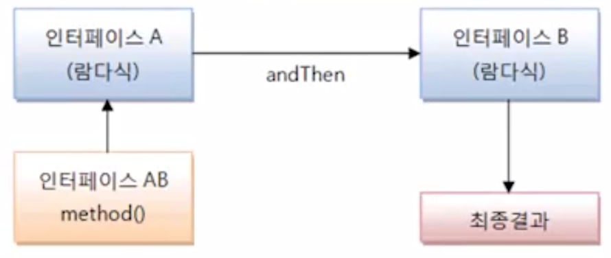
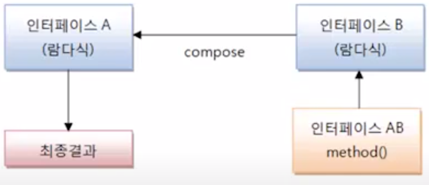

## 표준 API의 함수적 인터페이스

- Consumer 함수적 인터페이스
  - *Consumer 로 끝나는 함수들이며, <font color="orange">리턴값이 없는 accept() 메소드</font>를 가지고 있다.
  - accept()메소드는 단지 매개값을 소비하는 역할을 한다. 리턴값이 없는게 특징
  - 여기서 소비라는건 메소드 안에서 로직이 수행되고 끝나는걸 의미 (아래 구체적으로 이런느낌)
    * Consumer<T> 
    >Consumer<String consumer = t -> { t를 소비하는 실행문; };
    * BIConsumer<T, U>
    >BiConsumer<String, String> consumer = (t, u) -> t와 u를 소비하는 실행문; };
    * DoubleConsumer
    >DoubleConsumer consumer =d -> {d를 소비하는 실행문 };
    * ObjIntConsumer
    >ObjIntConsumer<String> consumer = (t, i) -> {t<string>과 i<int>를 소비하는 실행문 };
  
- Supplier 함수적 인터페이스
  - Supplier 함수적 인터페이스의 특징은 <font color="orange">매개변수가 없고, 리턴값이 있는</font> getXXX()메소드를 가진다.
  - 이들 메소드는 실행 후 호출한 곳으로 데이터를 리턴하는 역할을 한다.
    * Supplier<T>
    > Supplier<String> supplier = () -> { ...; return "문자열"; };
    * BooleanSupplier
    * DoubleSupplier
    * IntSupplier
    * LongSupplier

- **Function 함수적 인터페이스**
  - Function 함수적 인터페이스 특징은 <font color="orange">매개변수와 리턴값이 있는</font> applyXXX() 메소드를 가지고 있다.
  - 이들 메소드는 매개값을 리턴값으로 매핑(타입변환)하는 역할을 한다.
    * Function<T, R>   | R apply(T t) | 객체 T를 R로 매핑하여 반환
    * BiFunction<T, U, R> | R apply(T t, U, u) | 객체 T와 U를 받아 R로 반환
    * ToIntFunction<T> | int apply(T, t) | T로 받아서 int로 반환
    * 이외에 Function 타입 함수적 인터페이스 종류가 상당히 많다.

- Operator 함수적 인터페이스
  - Operator 함수적 인터페이스의 특징은 Function과 동일하게 <font color="orange">매개변수와 리턴값이 있는 applyXXX()메소드</font>를 가지고 있다.
  - 그러나 이들 메소드는 매개값을 리턴값으로 매핑()(타입변환)하는 역할보다는 매개값을 이용해서 <font color="orange">연산을 수행한 후 동일한 타입으로 리턴값을 제공</font>하는 역할을 한다.
    * BinaryOperator<T> | BiFunction<T, T, T>의 하위 인터페이스 | T와 T를 연산 후 T로 리턴
    * UnaryOperator<T> | Function<T, R>의 하위 인터페이스 | T를 연산 후 R 리턴
    * IntBinaryOperator | int applyAsInt(int, int) | 두개의 int 연산
    * IntUnaryOperator | int applyAsInt(int) | 한개의 int 연산

- Predicate 함수적 인터페이스
  - Predicate 함수적 인터페이스의 특징은 <font color="orange">매개변수와 boolean 리턴값</font>이 있는 testXXX() 메소드를 가지고 있다.
  - 이들 메소드는 <font color="orange">매개값을 조사해서 ture 또는 false를 리턴</font>하는 역할을 한다.
  - 매개변수 타입과 수에 따라서 아래와 같은 Predicate함수적 인터페이스들이 있다.
    * Predicate<T> | boolean test(T t) | 객체 T를 조사
    * BiPredicate<T, U> | boolean test(T t, U u) | 객체 T U를 조사
    * IntPredicate | boolean test(int value) | int value를 조사
    > Predicate<Student> predicate = t -> { return t.getSex().equals("남자"); }<br>
    또는<br>Predicate<Student> predicate = t -> t.getSex().equals("남자");

- andThen()과 Compose() 디폴트 메소드
  - 함수적 인터페이스가 가지고 있는 디폴트 메소드다.
  - <font color="orange">두개의 함수적 인터페이스를 순차적으로 연결</font>해서 실행한다.
  - <font color="orange">첫번째 리턴값을 두번째 매개값으로 제공</font>해서 최종 결과값을 리턴한다.
  - 
  - andThen()과 compose()의 차이점은 어떤 함수적 인터페이스 부터 처리하느냐 이다. (순서가 다름)
    - andThen() 디폴트 메소드
    > 인터페이스 AB = 인터페이스A.andThen(인터페이스 B);<br>
    최종결과 = 인터페이스 AB.method();

    - compose() 디폴트 메소드
    > 인터페이스 AB = 인터페이스A.compose(인터페이스 B);<br>
    최종결과 = 인터페이스 AB.method();

    - 예시1, Comsumer의 순차적 연결
      - Consumer종류의 함수적 인터페이스는 결과를 리턴하지 않는다.
      ``` 
      Consumer<Member> consumerA = (m) -> {
         System.out.println("consumerA: " + m.getName()); 
      }
      Consumer<Member> consumerB = (m) -> {
         System.out.println("consumerB: " + m.getId()); 
      }
      
      Consumer<Member> consumerAB = consumerA.andThen(consumerB);
      consumerAB.accept(new Member("홍길동", "hong", null));
      // andThen : consumerB부터 수행하고 consumerA를 이후 수행한다. 
      ```

    - 예시2, Function의 순차적 연결
      - Function과 Operator 종류의 함수적 인터페이스는 먼저 실행한 함수적 인터페이스의 결과를
      - 다음 함수적 인터페이스의 매개값으로 넘겨주고, 최종 처리결과를 리턴한다.

### 5. and(), or(), negate() 디폴트 메소드와 isEqual() 정적 메소드

- and() or() negate() 디폴트 메소드
  - Predicate 함수적 인터페이스의 디폴트 메소드
  - and() : && 와 대응 - 두 Predicate가 모두 true를 리턴하면 최종적으로 ture를 리턴
  - or() : || 와 대응 - 두 Predicate중 하나이상 true를 리턴하면 최종적으로 trur를 리턴
  - negate() : ! 와 대응 - Predicate의 반대값을 리턴
- isEqual() 정적 메소드
  - Predicate<T>의 정적 메소드
  ```
  Predicate<Object> predicate = Predicate.isEquals(Target);<br>
  boolean result = predicate.test(sourceObject);
  ```
    

- minBy(), maxBy() 정적 메소드
  - BinaryOperator<T> 함수적 인터페이스의 정적 메소드
  - Comparator를 이용해서 최대 T와 최소 T를 얻는 BinaryOperator<T>를 리턴한다.
  - Comparator<T>를 타겟 타입으로 하는 람다식은 아래처럼 작성할 수 있다.
  - (o1, o2) -> {...; return int 값; }
  - o1과 o2가 int 타입이라면 다음과 같이 Integer.compare(int, int) 메소드를 이용할 수 있다.
  - (o1, o2) -> Integer.compare(o1, o2);