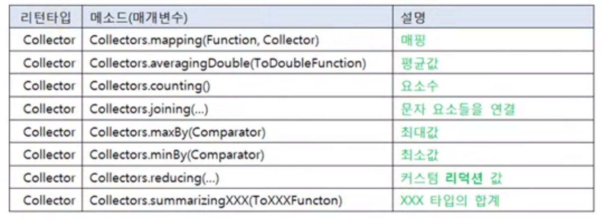

## 스트림 최종처리기능
### 루핑 forEach() 최종 처리
- forEach() : 최종 처리 메소드
  - 최종 처리 기능으로 요소 전체를 반복하는 것을 말한다.
  ```
  intStream
      .filter( a -> a%2 == 0 )
      .forEach( a -> System.out.println(a) ) // peek없이 반복하려면 최종단에서 반복
  ```
### 매칭(matching)
- 최종 처리 기능으로 요소들이 특정 조건을 만족하는지 조사하는 것을 말한다.
- boolean 으로 반환
- 매칭 메소드
  - allMatch()
    - 모든 요소들이 매개값으로 주어진 Predicate의 조건을 만족하는지 조사
  - anyMatch()
    - 최소한 한 개의 요소가 매개값으로 주어진 Predicate의 조건을 만족하는지 조사
  - noneMatch()
    - 모든 요소들이 매개값으로 주어진 Predicate의 조건을 만족하지 않는지 조사
  - 
### 집계(Aggregate)
- 최종 처리 기능으로 하나의 값으로 산출한다.
  - 카운팅, 합계, 평균값, 최대값, 최소값 같이 하나의 값이 된다.
  - 대량의 데이터를 가공해서 축소하는 리덕션(Reduction)이라고 볼 수 있다.
- 스트림이 제공하는 기본 집계 함수
  - sum() 총합 => int, long, double 로 반환
  - count() 총개수 => long으로 반환
  - findFirst() 첫번째 요소 => OptionalXXX 로 반환
  - average() 평균 => OptionalDouble로 반환, Double로 반환하는게 아니라서, getAsDouble() 해줘야 함.
  - max(Comparator<T>) => Optional<T> 로 반환
  - max() 최대값 => OptionalXXX로 반환, 배열이나 리스트 요소에 따라 갈릴듯
  - min(Comparator<T>) => Optional<T> 로 반환
  - min() 최소값 => OptionalXXX로 반환, 배열이나 리스트 요소에 따라 갈릴듯
- Optional 클래스
  - 값을 저장하는 값 기반 클래스
    - Optional, OptionalDouble, OptionalInt, OptionalLong
    - 집계 메소드의 리턴 타입으로 사용되어 집계 값을 가지고 있음
  - 특징
    - 집계 값이 존재하지 않을 경우 디폴트 값을 설정할 수도 있다.
    - 집계 값을 처리하는 Consumer를 등록할 수 있다.
  - 주목할만한 메소드
    - isPresent() => boolean 반환, 값이 저장되어 있는지 여부 판단
    - orElse( T int long double) => 값이 저장되지 않았다면, null이면 대체값 출력
    - ifPresent(XXXConsumer) => 값이 저장되어 있다면 Consumer 적용
- reduce()
  - 프로그램화해서 다양한 집계(리덕션) 결과물을 만들수 있다.
    - Stream .reduce(BinaryOperator<T> accumulator) => Optional<T> 리턴
    - Stream .reduce(T identity, BinaryOperator<T> accumulator) => Optional<T> 리턴
    - IntStream .reduce(IntBinaryOperator<T> op) => OptionalInt 리턴
    - IntStream .reduce(int identity, IntBinaryOperator<T> op) => int Or Optional<T> 리턴
    - LongStream .reduce(LongBinaryOperator<T> op) => OptionalLong 리턴
    - LongStream .reduce(long identity, LongBinaryOperator<T> op) => long Or OptionalLong 리턴
    - DoubleStream .reduce(DoubleBinaryOperator<T> op) => OptionalDouble 리턴
    - DoubleStream .reduce(double identity, DoubleBinaryOperator<T> op) => Double Or OptionalDouble 리턴
  - 매개변수로 사용되는 주요 요소
    - identity: 스트림에 요소가 전혀 없을 경우 리턴될 디폴트 값 
    - XXXBinaryOperator, 두 개의 매개값을 받아 연산 후 리턴하는 함수적 인터페이스
  ```
  int sum = studentList.stream()
      .map(Student :: getScore)
      .reduce( (a,b) -> a + b)
      .get();    // --> NoSuchElementException 발생 가능 (요소가 없을경우 get() 시 에러)
  // 여기 reduce는 요소가 있을 경우에만 동작한다.
  
  int sum = studentList.stream()
      .map(Student :: getScore)
      .reduce(0, (a,b) -> a + b); // --> .reduce(T identity, BinaryOperator<T> accumulator) 이방식으로 요소가 없을 경우 T identity를 반환한다.
  
      reduce((a, b) -> a+b)  이걸 합계 구하는걸로 외우는 수 밖에 없나 싶다.
  ```
### 수집
- 수집 - collect()
  - 최종 처리 기능으로 요소들을 수집 또는 그룹핑한다.
    - 필터링 또는 매핑된 요소들로 구성된 새로운 컬렉션을 생성한다.
    - 컬렉션 형식으로 리턴한다.
  - 리턴타입 : R , 메소드: collect(Collector<T, A, R> collector)
    - T형식 데이터를 받아 A식으로 데이터를 R타입 콜렉션에 담는다.
  - Collector의 구현 객체
    - Collectors 클래스의 정적 메소드를 활용한다.
    - Collector<T, ?, Collection<T> > => Collectors.toCollection(Supplier<T>)
    - Collector<T, ?, ConcurrentMap<K,U> > => Collectors.toConcurrentMap(...)
    - Collector<T, ?, List<T> > => Collectors.toList()
    - Collector<T, ?, Map<K, U> > => Collectors.toMap(...)
    - Collector<T, ?, Set<T> >  => Collectors.toSet()
  - 여기서 A(누적기)가 ?인 이유
    - List, Set, Map 컬렉션에 누적할 경우에는 별도의 A(누적기)가 필요 없기 때문
  ```
   // 전체 학생 List에서 남학생들만 별도의 List로 생성
  List<Student> maleList = totalList.stream()
      .filter(s -> s.getSex() == Student.Sex.MALE)
      .collect(Collectors.toList());
  
   // 전체 학생 List에서 여학생들만 별도의 HashSet으로 생성
  List<Student> femaleList = totalList.stream()
      .filter(s -> s.getSex() == Student.Sex.FEMALE)
      .collect(Collectors.toCollection(HashSet :: new));  // HashSet 만들땐 이렇게한다.

  ```
- 사용자 정의 컨테이너에 수집하기 (이 설명만보면 너무 어렵다. 예제를 보자, stream_final/CustomCollectEx.java)
  - List, Set, Map에 수집하는 것이 아니라, 사용자 정의 컨테이너에 수집시키는 것을 말한다.
  - 리턴타입 R 일때, collect(supplier, accumulator, combiner) 형식으로 매개변수 정의
    - Stream => collect(Supplier<R>, BiConsumer<R, ? super T>, BiConsumer<R, R> )
    - IntStream => collect(Supplier<R>, ObjIntConsumer<R, ? super T>, BiConsumer<R, R> )
    - LongStream => collect(Supplier<R>, ObjLongConsumer<R, ? super T>, BiConsumer<R, R> )
    - DoubleStream => collect(Supplier<R>, ObjDoubleConsumer<R, ? super T>, BiConsumer<R, R> )
  - 매개변수
    - 첫번째 Supplier: 요소들이 수집될 컨테이너 객체를 생성하는 역할
      - 순차 처리(싱글 스레드) 스트림: 단 한번 Supplier가 실행
      - 병렬 처리(멀티 스레드) 스트림: 스레드별로 Supplier가 실행되어 스레드별로 컨테이너가 생성
    - 두번째 XXXConsumer: 컨테이너 객체에 요소를 수집하는 역할
      - 스트림에서 요소를 컨테이너에 누적할 때마다 실행
    - 세번째 BiConsumer: 컨테이너 객체를 결합하는 역할, (순차처리에선 사용되지 않으나 선언해줘야 함.)
      - 순차 처리(싱글 스레드) 스트림: 실행되지 않음
      - 병렬 처리(멀티 스레드) 스트림: 스레드별로 생성된 컨테이너를 결합해서 최종 컨테이너를 완성한다.
  - 리턴타입
    - R: 최종 누적된 컨테이너 객체
### 수집 collect() grouping(제일 어려운 부분)
- collect() 메소드는 단순히 요소를 수집하는 기능 이외에 <font color="orange">컬렉션의 요소들을 그룹핑해서 Map 객체로 생성</font>하는 기능도 제공
- collect( Collectors.groupingBy( ... )); 느낌으로 Collectors.groupingBy( ... ) 의 소스를 구현해여 map 형식으로 출력 가능
- map 객체로 반환하기 위한것
  - Collectors.groupingBy()의 리턴 객체를 <font color="orange">매개 값</font>으로 대입
    - 스레드에 안전하지 않는 Map 생성
  - Collectors.groupingByConcurrent()의 리턴 객체를 <font color="orange">매개 값</font>으로 대입.
    - 스레드에 안전한 ConcurrentMap 생성
  - 학생의 성을 key로 해서 남학생 List와 여학생 List가 저장된 Map 얻기
    ```
    Map<StudentEnum.Sex, List<StudentEnum> > mapBySex = totalList.stream()
         .collect(
            Collectors.groupingBy(
                StudentEnum :: getSex
            )
         );
    ```
  - 학생의 거주 도시를 key로 해서 학생의 이름 List가 저장된 Map 얻기
    ```
    Map<StudentEnum.City, List<String> > mapByCity = totalList.stream()
         .collect(
              Collectors.groupingBy(   
                   //s -> s.getCity()
                   StudentEnum::getCity() // 여기 들어가는건 Function<StudentEnum, StudentEnum.City> , Key 기준 불러옴
                   Collectors.mapping(StudentEnum::getName, Collectors.toList())  // Value 기준 불러옴, Function<StudentEnum, String>    Collector<String, ?, List<String> >
              )
         );
    ```
- 그룹핑 후 매핑 및 집계 ( 매핑(Mapping). - 사전적으로는 하나의 값을 다른 값으로 대응시키는 것을 의미 )
  - Collectors.groupingBy() 메소드는 그룹핑 후, 매핑이나 집계(평균, 카운팅, 연결, 최대, 최소, 합계)을 할 수 있도록 하기 위해, 두번째 매개값으로 다음과 같은 Collector를 가질 수 있다.
  - 
  - 성(sex)을 key로, 남/여 학생 평균점수를 value로 갖는 Map 얻기
  ```
    Map<StudentEnum.Sex, Double> mapAverage = totalList.stream()
         .collect(
              Collectors.groupingBy(   
                   //s -> s.getSex()
                   StudentEnum::getSex() // 여기 들어가는건 Function<StudentEnum, StudentEnum.Sex> , Key 기준 불러옴
                   Collectors.AveragingDouble(StudentEnum::getScore)  // Value 기준 불러옴, Function<StudentEnum, Double>    
              )
         );
  ```
  - 성(sex)을 key로, 쉼표로 구분된 학생 이름 문자열을 value로 갖는 Map 얻기
  ```
    Map<StudentEnum.Sex, String> mapString = totalList.stream()
         .collect(
              Collectors.groupingBy(   
                   //s -> s.getSex()
                   StudentEnum::getSex() // 여기 들어가는건 Function<StudentEnum, StudentEnum.Sex> , Key 기준 불러옴
                   Collectors.mapping(   // 함수대로 콜랙션 매핑, Function , Collector
                        StudentEnum::getName,
                        Collectors.joining(",")  // 문자 요소들을 연결
                   )      
              )
         );
  ```