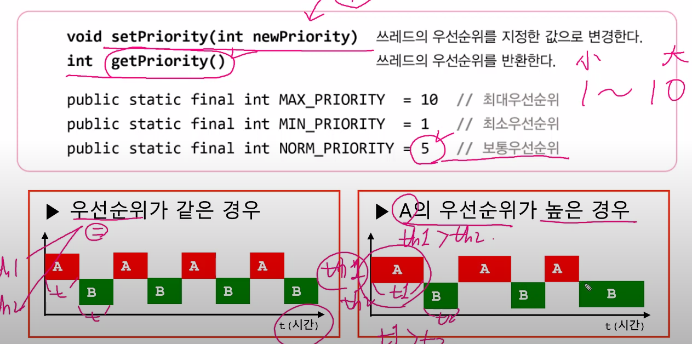

## 스레드의 우선순위
- 작업의 중요도에 따라 스레드의 우선순위를 다르게 하여
- 특정 스레드가 더 많은 작업시간을 갖게 할 수 있다.
* * thread.setPriority(10) // 최대 우선순위, 기본값은 5다.
* * thread.setPriority(1)   // 최소 우선순위
* * thread.getPriority()    // int형으로 우선순위 반환
