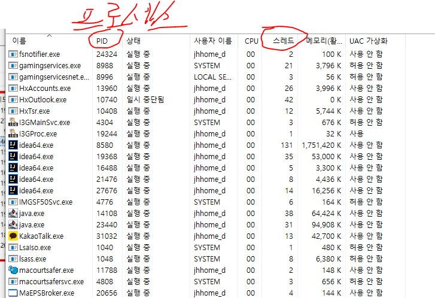

## 프로세스와 스레드

- 프로세스: 실행중인 프로그램, 자원(resources)과 쓰레드로 구성
- 쓰레드: 프로세스 내에서 실제 작업을 수행, 모든 프로세스는 최소 하나의 쓰레드를 가지고 있다.

1. 싱글 쓰레드 프로세스 = 자원 + 쓰레드
2. 멀티 쓰레드 프로세스 = 자원 + 쓰레드 + 쓰레드 + 쓰레드 + .... + 쓰레드
<스레드 한도 200~1000까지 잡아서 쓰는 곳도 있음>

윈도우에서 프로세스당 스레드가 몇개 쓰이는지도 확인 가능하다.
- 쓰레드를 많이 잡는 이유: 하나의 새로운 프로세스를 생성하는 것 보다 하나의 새로운 프로세스를 생성하는 것이 더 적은 자원이 든다.
- 싱글스레드 기준이라면, 웹서버 2개를 사용 하는 것 보다, 웹서버 1개를 사용하여 스레드를 늘리는게 더 자원효율적이다.

## 멀티스레드의 장점/단점
# 장점 (여러모로 편리해짐)
- 시스템 자원을 보다 효율적으로 사용할 수 있다.
- 사용자에 대한 응답성이 향상됨, 하나의 작업중에 다른 작업을 동시에 할 수 있으니
- 작업이 분리되어 코드가 간결해진다.
# 단점 (프로그래밍 시 고려해야 할 부분)
- 동기화(synchronization)에 주의해야 한다.
- 교착상태(dead-lock)가 발생하지 않도록 주의해야한다. 서로 자원을 선점하기위해 교착되는 문제 발생안하도록 주의
- 각 스레드가 효율적으로 고르게 실행될 수 있게 해야 한다.

코드를 짜는데있어 좋은 코드는 에러가 적고 잘 동작하는 코드다.
